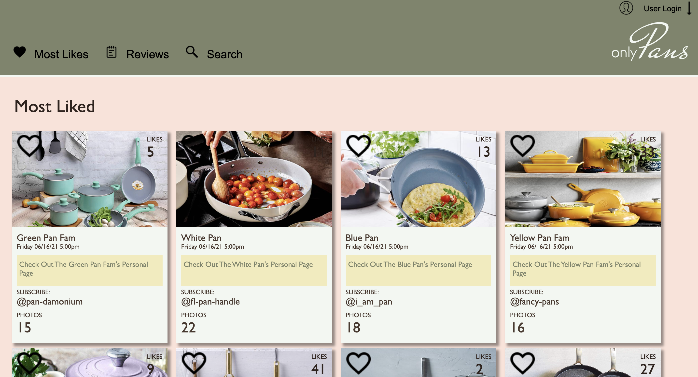
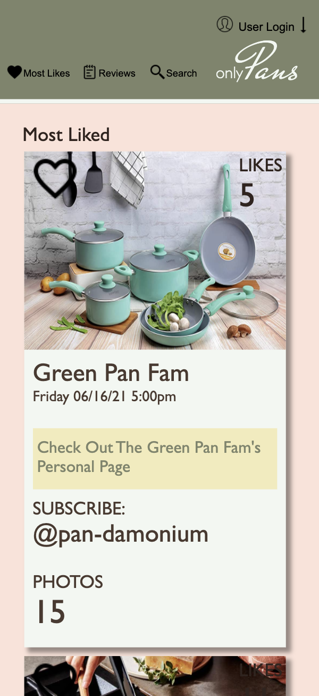
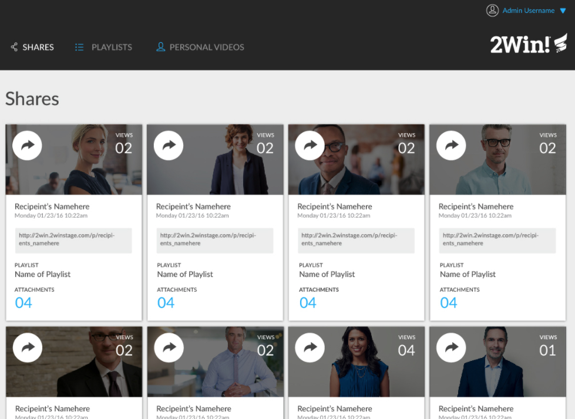

### Description
Welcome to the onlyPans static comp! A comp recreation challenge, where I was tasked to re-create the layout of a specific comp (with some creative license liberties).

### How it Works
Visit the github pages deployed site to view the desktop and mobile versions of this Comp

### Technologies Used
- JavaScript
- CSS
- HTML

*********************************************************
Github Pages Link: https://cmeubanks.github.io/static-comp-project/

#### Contributors:
- Caroline Eubanks

## Images

Desktop View:

Mobile View:

Comp style to match:

